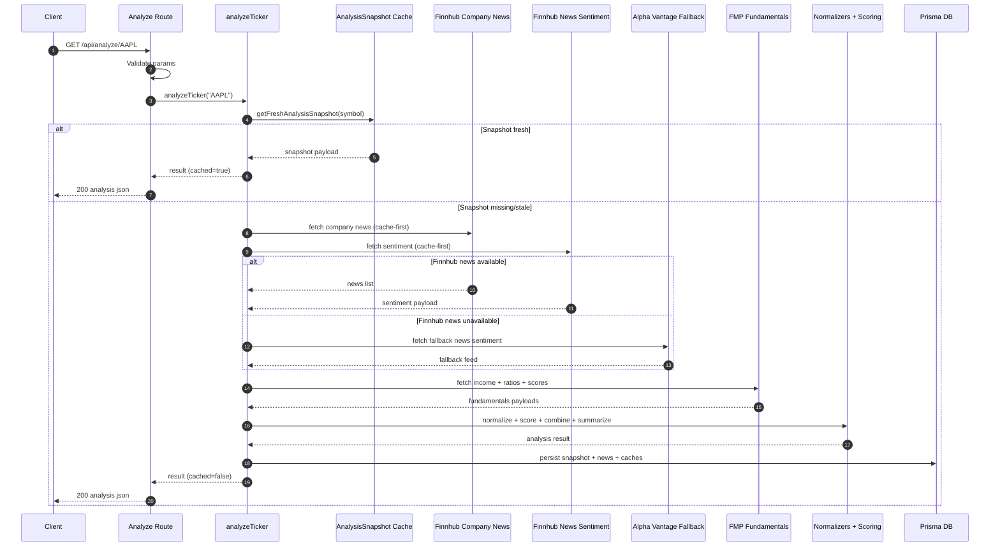
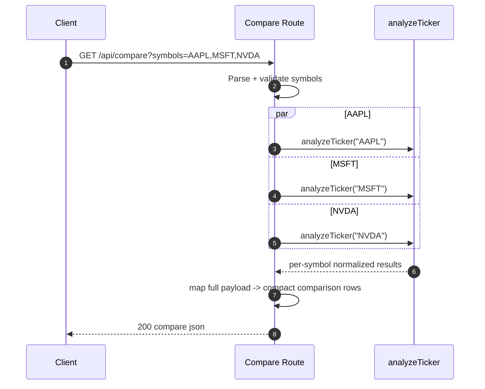
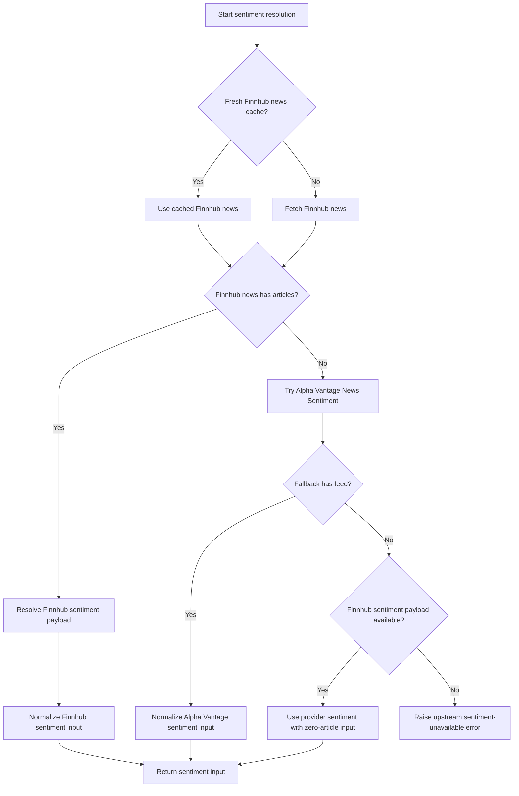
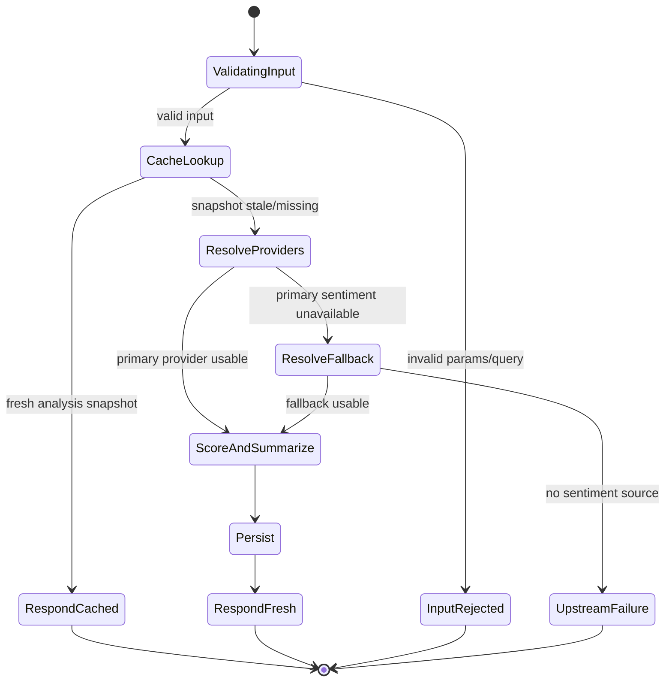

# Stock Sentiment MVP Architecture

This document describes the phase 1 backend and data architecture for the stock sentiment analysis MVP in this package. It focuses on how data moves through the system, which modules own which responsibilities, and where future UI work should integrate.

## Goals

Phase 1 is intentionally backend-heavy. The current app now has:

- provider integrations for news, sentiment, and fundamentals
- runtime validation of external API responses
- normalization into internal domain models
- deterministic scoring and summary generation
- SQLite persistence through Prisma
- 15 minute caching for provider payloads and analysis snapshots
- API routes that return normalized app-owned JSON

Phase 1 does not include a final dashboard UI, React Query wiring, charts, or tests.

## High-Level Architecture

The system follows a layered architecture:

1. Route handlers accept input and return normalized JSON.
2. The analysis orchestrator coordinates the workflow for a ticker.
3. Provider adapters fetch raw external data.
4. Zod schemas validate raw provider responses.
5. Normalizers convert provider-specific shapes into internal domain models.
6. Scoring services compute sentiment, fundamentals, and combined scores.
7. Summary generation produces deterministic plain-English output.
8. Prisma persists raw provider cache, analysis snapshots, and normalized news articles.

The important rule is that provider-specific response shapes should not leak outside the provider and normalization boundary.

## Directory Responsibilities

### `app/api/`

- [app/api/analyze/[symbol]/route.ts](/Users/seanlee/code/0dte-goes-crazy/app/api/analyze/[symbol]/route.ts)
  - validates the symbol input
  - calls the shared analysis orchestrator
  - returns a full analysis payload
  - maps errors to useful HTTP responses

- [app/api/compare/route.ts](/Users/seanlee/code/0dte-goes-crazy/app/api/compare/route.ts)
  - validates comma-separated symbols
  - calls the same analysis orchestrator for each symbol
  - returns a compact comparison response

### `lib/`

- [lib/env.ts](/Users/seanlee/code/0dte-goes-crazy/lib/env.ts)
  - parses and validates environment variables
  - central place for runtime config values

- [lib/http.ts](/Users/seanlee/code/0dte-goes-crazy/lib/http.ts)
  - wraps `fetch`
  - applies timeout, retry, backoff, and structured error handling
  - validates JSON payloads via Zod before returning them

- [lib/config/scoring.ts](/Users/seanlee/code/0dte-goes-crazy/lib/config/scoring.ts)
  - defines cache TTL
  - defines sentiment/fundamentals weights
  - defines provider quality multipliers and thresholds

- [lib/prisma.ts](/Users/seanlee/code/0dte-goes-crazy/lib/prisma.ts)
  - creates the Prisma singleton

- [lib/symbol.ts](/Users/seanlee/code/0dte-goes-crazy/lib/symbol.ts)
  - normalizes and validates ticker symbols

### `types/`

- [types/external.ts](/Users/seanlee/code/0dte-goes-crazy/types/external.ts)
  - owns provider-facing Zod schemas and raw external types
  - this is the boundary for external data validation

- [types/domain.ts](/Users/seanlee/code/0dte-goes-crazy/types/domain.ts)
  - owns app-internal normalized models
  - these are the shapes the rest of the app should use

### `services/providers/`

- [services/providers/finnhub.ts](/Users/seanlee/code/0dte-goes-crazy/services/providers/finnhub.ts)
  - fetches company news
  - fetches Finnhub news sentiment

- [services/providers/alphavantage.ts](/Users/seanlee/code/0dte-goes-crazy/services/providers/alphavantage.ts)
  - fetches Alpha Vantage News & Sentiment
  - used as fallback for sentiment/news when needed

- [services/providers/fmp.ts](/Users/seanlee/code/0dte-goes-crazy/services/providers/fmp.ts)
  - fetches income statement data
  - fetches ratios TTM
  - fetches financial scores

Provider modules should do only provider-specific concerns:

- endpoint construction
- API key handling
- response fetch
- response validation

They should not do app scoring or persistence logic.

### `services/normalizers/`

- [services/normalizers/news.ts](/Users/seanlee/code/0dte-goes-crazy/services/normalizers/news.ts)
  - converts Finnhub and Alpha Vantage news into one normalized article model

- [services/normalizers/sentiment.ts](/Users/seanlee/code/0dte-goes-crazy/services/normalizers/sentiment.ts)
  - converts provider sentiment payloads into a normalized sentiment input model
  - computes a normalized provider sentiment score when possible

- [services/normalizers/fundamentals.ts](/Users/seanlee/code/0dte-goes-crazy/services/normalizers/fundamentals.ts)
  - converts FMP outputs into a normalized fundamentals model

This layer is the translation boundary between external APIs and internal business logic.

### `services/scoring/`

- [services/scoring/sentiment.ts](/Users/seanlee/code/0dte-goes-crazy/services/scoring/sentiment.ts)
  - computes normalized sentiment score in `-1..1`
  - uses provider sentiment when available
  - falls back to rule-based headline scoring when needed
  - computes confidence score from article count, recency, and provider quality
  - builds a simple trend series from normalized articles

- [services/scoring/fundamentals.ts](/Users/seanlee/code/0dte-goes-crazy/services/scoring/fundamentals.ts)
  - computes fundamentals quality score in `0..100`
  - uses revenue growth, profitability, margins, leverage/liquidity, and financial health inputs
  - degrades to a neutral baseline if data is missing

- [services/scoring/combine.ts](/Users/seanlee/code/0dte-goes-crazy/services/scoring/combine.ts)
  - converts sentiment `-1..1` into a `0..100` comparable scale
  - combines scores with `60% sentiment / 40% fundamentals`
  - assigns bullish, neutral, or bearish label

### `services/summary/`

- [services/summary/generateSummary.ts](/Users/seanlee/code/0dte-goes-crazy/services/summary/generateSummary.ts)
  - produces a deterministic, non-LLM summary string
  - consumes normalized/scored internal outputs only

### `services/analysis/`

- [services/analysis/analyzeTicker.ts](/Users/seanlee/code/0dte-goes-crazy/services/analysis/analyzeTicker.ts)
  - the main application orchestrator
  - checks analysis cache first
  - coordinates provider calls and fallbacks
  - invokes normalizers and scoring services
  - generates summary
  - persists snapshot and normalized news
  - returns the final response shape

- [services/analysis/cache.ts](/Users/seanlee/code/0dte-goes-crazy/services/analysis/cache.ts)
  - encapsulates raw payload cache reads/writes
  - encapsulates analysis snapshot cache reads

## API Layer Deep Dive

This section documents the API boundary in detail: request contracts, response contracts, control flow, failure semantics, and internal call graph.

### Runtime and boundary contracts

- Both route handlers run in Node runtime with `export const runtime = "nodejs"`.
- Route handlers are intentionally thin orchestration boundaries.
- Route handlers do not call providers directly.
- Route handlers call `analyzeTicker()` only.
- Route handlers return app-owned normalized JSON, not provider payloads.
- Provider errors are mapped into user-facing HTTP responses with stable error shape.

### Endpoint contracts

#### `GET /api/analyze/[symbol]`

Purpose:

- return full normalized analysis for one ticker

Input:

- path param `symbol`

Validation:

- `symbol` must be a non-empty string
- symbol is normalized by [lib/symbol.ts](/Users/seanlee/code/0dte-goes-crazy/lib/symbol.ts)

Success response:

- `200 OK` with full `AnalysisResult` shape
- includes `cached` boolean
- includes normalized articles, sentiment, fundamentals, combined score, and summary

Error responses:

- `400` for invalid input
- `502` when sentiment cannot be resolved from any source
- `503` when required provider key configuration is missing
- `500` for unexpected server faults

#### `GET /api/compare?symbols=AAPL,MSFT,NVDA`

Purpose:

- return compact analysis rows for multiple symbols

Input:

- query param `symbols`, comma-separated ticker list

Validation:

- required
- at least 1 symbol
- maximum 5 symbols
- whitespace trimmed per symbol

Execution model:

- fan-out to `analyzeTicker(symbol)` for each input symbol using `Promise.all`
- each symbol receives the same cache/fallback/scoring pipeline as analyze endpoint

Success response:

- `200 OK` with:
- `symbols` array
- `results` array with compact fields: symbol, generatedAt, cached, sentimentScore, confidenceScore, fundamentalsQualityScore, combinedScore, label, summary

Error responses:

- `400` for malformed query input
- `503` for provider config failures
- `502` for upstream sentiment resolution failure
- `500` for unknown internal failures

### Analyze response shape

Canonical response contract for `/api/analyze/[symbol]`:

```json
{
  "symbol": "AAPL",
  "generatedAt": "2026-04-03T05:15:00.000Z",
  "cached": false,
  "summary": "AAPL shows moderately bullish sentiment...",
  "articles": [
    {
      "symbol": "AAPL",
      "provider": "finnhub",
      "headline": "Apple earnings beat expectations",
      "summary": "Short summary",
      "source": "Reuters",
      "url": "https://example.com/news/1",
      "publishedAt": "2026-04-03T02:00:00.000Z",
      "sentimentScore": null
    }
  ],
  "sentiment": {
    "sentimentScore": 0.36,
    "confidenceScore": 74,
    "articleCount": 15,
    "providerUsed": "finnhub",
    "usedFallback": false,
    "trend": [
      {
        "date": "2026-04-01",
        "score": 0.22
      }
    ]
  },
  "fundamentals": {
    "fundamentalsQualityScore": 69,
    "available": true,
    "notes": [
      "Revenue growth is positive.",
      "Net income is positive."
    ]
  },
  "combined": {
    "combinedScore": 70,
    "label": "bullish"
  }
}
```

### Compare response shape

Canonical response contract for `/api/compare`:

```json
{
  "symbols": ["AAPL", "MSFT", "NVDA"],
  "results": [
    {
      "symbol": "AAPL",
      "generatedAt": "2026-04-03T05:15:00.000Z",
      "cached": true,
      "sentimentScore": 0.36,
      "confidenceScore": 74,
      "fundamentalsQualityScore": 69,
      "combinedScore": 70,
      "label": "bullish",
      "summary": "AAPL shows moderately bullish sentiment..."
    }
  ]
}
```

### API error object shape

Current error body contract:

```json
{
  "error": "Human-readable message"
}
```

Validation failures include:

```json
{
  "error": "Invalid input",
  "issues": [
    {
      "path": ["symbols"],
      "message": "At least one symbol is required"
    }
  ]
}
```

### API layer call graph

```mermaid
flowchart TD
  A[Client] --> B[/api/analyze/[symbol]]
  A --> C[/api/compare]
  B --> D[analyzeTicker]
  C --> D
  D --> E[AnalysisSnapshot cache]
  D --> F[Finnhub provider]
  D --> G[Alpha Vantage provider fallback]
  D --> H[FMP provider]
  F --> I[Zod external schemas]
  G --> I
  H --> I
  D --> J[Normalizers]
  J --> K[Scoring]
  K --> L[Summary generator]
  D --> M[Prisma persistence]
  D --> N[Normalized API response]
```

### Sequence diagram for `/api/analyze/[symbol]`



### Sequence diagram for `/api/compare`



### Sentiment provider fallback decision flow



### API state model



### API-layer invariants

- API routes never expose provider raw payloads.
- API routes never expose API keys.
- Every success response for analyze includes all three score domains: sentiment, fundamentals, combined.
- Every success response for compare is compact and deterministic in field naming.
- Symbol normalization happens before cache keying and provider access.
- Provider fallback is attempted before returning sentiment-unavailable failures.
- Fundamentals absence does not hard-fail analysis; it degrades to a neutral baseline.

### API-layer performance notes

- `/api/analyze/[symbol]` short-circuits on fresh snapshot cache.
- `/api/analyze/[symbol]` avoids repeated provider hits through raw payload cache.
- `/api/compare` uses parallel fan-out via `Promise.all`.
- FMP endpoints are fetched in parallel during fundamentals resolution.
- The current implementation does not apply per-request concurrency limits for compare; max symbols is capped at 5 to constrain load.

### API-layer extension points

- add `x-request-id` propagation and structured logs in route handlers
- add response metadata fields such as `cacheAgeMs` and `providersUsed`
- add partial-success envelope for compare if future requirements prefer per-symbol error isolation over all-or-nothing failure
- add pagination and article limits in analyze response for high-volume symbols
- add optional `includeArticles=false` query switch for lightweight responses

## End-to-End Data Flow

This is the main request lifecycle for `GET /api/analyze/[symbol]`.

### Step 1: Request enters route handler

The request enters:

- [app/api/analyze/[symbol]/route.ts](/Users/seanlee/code/0dte-goes-crazy/app/api/analyze/[symbol]/route.ts)

The route handler:

- reads `symbol` from route params
- validates input with Zod
- calls `analyzeTicker(symbol)`

At this layer, the route still knows nothing about providers or scoring rules.

### Step 2: Ticker is normalized

Inside:

- [lib/symbol.ts](/Users/seanlee/code/0dte-goes-crazy/lib/symbol.ts)

The symbol is:

- trimmed
- uppercased
- stripped to a safe ticker format

This gives a consistent key for:

- external requests
- database storage
- cache lookup

### Step 3: Analysis snapshot cache is checked

Inside:

- [services/analysis/cache.ts](/Users/seanlee/code/0dte-goes-crazy/services/analysis/cache.ts)

The orchestrator first looks for a recent `AnalysisSnapshot` row for the symbol.

If a snapshot exists and is newer than the 15 minute TTL:

- the stored JSON payload is returned immediately
- no provider calls are made
- the response is marked `cached: true`

This is the fastest path.

### Step 4: Sentiment source resolution begins

If no fresh analysis snapshot exists, the orchestrator fetches sentiment/news data.

Primary path:

1. read cached Finnhub company news payload if available
2. otherwise fetch Finnhub company news
3. read cached Finnhub sentiment payload if available
4. otherwise fetch Finnhub sentiment

Fallback path:

1. if Finnhub news is unavailable or empty, try Alpha Vantage News & Sentiment
2. use Alpha Vantage normalized article sentiment as fallback input

Last-resort path:

1. if news articles are unavailable but Finnhub sentiment payload exists
2. use that provider-level sentiment with zero articles

Failure path:

1. if neither Finnhub nor Alpha Vantage can provide usable sentiment input
2. throw a controlled upstream error

### Step 5: Raw provider payloads are cached

Provider payloads are cached in:

- `TickerCache`

Each cached row is keyed by:

- `symbol`
- `provider`

Examples of provider cache keys:

- `finnhub:company-news`
- `finnhub:news-sentiment`
- `alphavantage:news-sentiment`
- `fmp:income-statement`
- `fmp:ratios-ttm`
- `fmp:financial-scores`

The raw payload is stored as serialized JSON text in SQLite.

This design allows:

- reusing recent provider responses
- debugging provider fetch issues
- keeping provider cache separate from analysis output cache

### Step 6: External payloads are normalized

Raw payloads are converted into internal shapes.

For news:

- both Finnhub and Alpha Vantage articles become one normalized article model

Normalized news article fields include:

- symbol
- provider
- headline
- summary
- source
- url
- publishedAt
- sentimentScore

For sentiment:

- provider-level sentiment is normalized to `-1..1` when possible
- provider quality and fallback status are attached

For fundamentals:

- revenue growth
- positive net income flag
- net margin / operating margin
- current ratio
- debt to equity
- Altman Z score
- Piotroski score
- availability flag

After this stage, business logic is operating only on app-owned domain types.

## Sentiment Scoring Flow

Sentiment scoring is handled in:

- [services/scoring/sentiment.ts](/Users/seanlee/code/0dte-goes-crazy/services/scoring/sentiment.ts)

### Inputs

- normalized provider sentiment score if available
- normalized news articles
- provider quality multiplier
- fallback metadata

### Scoring rules

The sentiment service does:

1. assign each article a sentiment score
2. use article-level provider sentiment where available
3. otherwise use a simple keyword-based headline scorer
4. weight articles by recency
5. combine provider sentiment and article-derived sentiment

### Recency weighting

Newer articles matter more than older ones.

The current heuristic roughly weights:

- 0-1 days: highest weight
- 1-3 days: strong weight
- 3-7 days: moderate weight
- 7-14 days: weaker weight

### Confidence score

Confidence is computed from:

- article count
- average recency
- provider quality
- whether a provider-level sentiment score was available

This creates a score from `0..100`.

### Trend output

The service groups article sentiment by day and emits a short trend series:

- `date`
- `score`

This is intended for later Recharts use in the dashboard phase.

## Fundamentals Scoring Flow

Fundamentals scoring is handled in:

- [services/scoring/fundamentals.ts](/Users/seanlee/code/0dte-goes-crazy/services/scoring/fundamentals.ts)

### Inputs

- normalized revenue growth
- profitability status
- margin quality
- leverage/liquidity signals
- financial health indicators

### Heuristics

The service awards score contribution for:

- positive or strong revenue growth
- positive net income
- healthy profit margins
- reasonable debt or acceptable liquidity
- strong Altman Z or Piotroski scores

If fundamentals data is not available:

- the score falls back to `50`
- `available` is set to `false`
- a note explains that a neutral baseline was used

### Why this matters

This design allows sentiment to continue working even if FMP data is incomplete or unavailable.

## Combined Score Flow

Combined scoring is handled in:

- [services/scoring/combine.ts](/Users/seanlee/code/0dte-goes-crazy/services/scoring/combine.ts)

### Formula

1. Convert sentiment from `-1..1` into `0..100`
2. Combine with:
   - 60% sentiment
   - 40% fundamentals

### Labels

- `bullish` if score >= 67
- `neutral` if score is 40 to 66
- `bearish` if score < 40

## Summary Generation Flow

Summary generation is handled in:

- [services/summary/generateSummary.ts](/Users/seanlee/code/0dte-goes-crazy/services/summary/generateSummary.ts)

The summary is deterministic. It uses:

- symbol
- sentiment strength
- article count
- fundamentals notes
- final label

This ensures:

- no LLM dependency
- stable output for caching and tests later
- readable API responses for manual verification

## Fundamentals Provider Flow

Fundamentals resolution happens in parallel where possible:

- income statement
- ratios TTM
- financial scores

Each of those payloads uses the same pattern:

1. try raw cache
2. fetch from FMP if needed
3. validate with Zod
4. normalize into one internal fundamentals model

If one endpoint fails but others succeed:

- normalization still proceeds
- missing fields stay `null`
- fundamentals scoring degrades gracefully

## Database Design

Prisma schema:

- [prisma/schema.prisma](/Users/seanlee/code/0dte-goes-crazy/prisma/schema.prisma)

### `TickerCache`

Purpose:

- cache raw provider responses for 15 minutes

Fields:

- `symbol`
- `provider`
- `payload`
- `fetchedAt`

### `AnalysisSnapshot`

Purpose:

- store full normalized analysis output for quick re-use

Fields:

- `symbol`
- `sentimentScore`
- `confidenceScore`
- `fundamentalsQualityScore`
- `combinedScore`
- `label`
- `summary`
- `payload`
- `createdAt`

### `NewsArticle`

Purpose:

- persist normalized news articles for local inspection and future UI reuse

Fields:

- `symbol`
- `provider`
- `headline`
- `summary`
- `source`
- `url`
- `publishedAt`
- `sentimentScore`

## Caching Strategy

The app uses two cache layers.

### Raw provider cache

Stored in `TickerCache`.

Used to:

- reduce API calls
- reduce cost and rate-limit pressure
- allow provider retry/fallback logic without refetching repeatedly

TTL:

- 15 minutes

### Analysis snapshot cache

Stored in `AnalysisSnapshot`.

Used to:

- return the final normalized result quickly
- skip all provider/normalizer/scoring work when the result is still fresh

TTL:

- 15 minutes

### Why both layers exist

If only full analysis were cached:

- provider payloads would be lost for debugging and inspection

If only raw payloads were cached:

- every request would still redo normalization, scoring, and summary generation

Using both gives better operational flexibility.

## Error Handling Strategy

### External fetch errors

Handled in:

- [lib/http.ts](/Users/seanlee/code/0dte-goes-crazy/lib/http.ts)

Behavior:

- timeout support
- retry with backoff
- validated JSON parsing
- typed `HttpError`

### Provider failure handling

Handled in:

- [services/analysis/analyzeTicker.ts](/Users/seanlee/code/0dte-goes-crazy/services/analysis/analyzeTicker.ts)

Behavior:

- Finnhub failure does not immediately fail the request
- Alpha Vantage is attempted as sentiment fallback
- fundamentals can degrade to neutral
- only hard-fail when no usable sentiment input remains

### API response handling

Handled in:

- [app/api/analyze/[symbol]/route.ts](/Users/seanlee/code/0dte-goes-crazy/app/api/analyze/[symbol]/route.ts)
- [app/api/compare/route.ts](/Users/seanlee/code/0dte-goes-crazy/app/api/compare/route.ts)

Behavior:

- invalid input returns `400`
- missing provider configuration returns `503`
- upstream provider failure returns `502` where inferred
- unknown internal failures return `500`

## Request Lifecycle Example

Example for `GET /api/analyze/AAPL`:

1. Route validates `AAPL`
2. `analyzeTicker("AAPL")` is called
3. Fresh `AnalysisSnapshot` lookup runs
4. If stale or missing, Finnhub news cache is checked
5. Finnhub company news is fetched if needed
6. Finnhub sentiment cache is checked
7. Finnhub sentiment is fetched if needed
8. If Finnhub news is missing, Alpha Vantage fallback is attempted
9. FMP income statement, ratios, and financial scores are resolved
10. Raw provider data is normalized
11. Sentiment score and confidence are computed
12. Fundamentals quality score is computed
13. Combined score and label are computed
14. Deterministic summary is generated
15. `AnalysisSnapshot` is stored
16. Normalized `NewsArticle` rows are upserted
17. Final JSON response is returned

## Current Design Tradeoffs

### Strengths

- clean provider boundary
- internal domain types are explicit
- easy to add more scoring signals later
- caching is straightforward and inspectable
- route handlers are thin and reusable
- no provider internals leak to clients

### Intentional simplifications

- no background jobs
- no queueing
- no rate-limit manager beyond caching and retry
- no Redis or distributed cache
- no test suite yet
- no client-side React Query integration yet
- no chart UI yet

These are appropriate for the current MVP phase.

## Phase 2 Integration Notes

When the dashboard UI is built later:

- API routes can stay stable
- React Query should call `/api/analyze/[symbol]` and `/api/compare`
- Recharts can consume `analysis.sentiment.trend`
- the UI should use normalized API outputs only
- the UI should not call providers directly

Recommended future additions:

- better sentiment keyword lexicon
- article deduplication across providers
- provider health telemetry
- explicit stale/fresh metadata in API responses
- richer fundamentals heuristics by sector
- tests for scoring and normalization
- compare page and ticker page UI

## One-Sentence System Summary

The system accepts a ticker, reuses fresh cached analysis when possible, otherwise fetches validated provider data, normalizes it into internal models, scores sentiment and fundamentals deterministically, persists the result, and returns a clean app-owned JSON payload through App Router API routes.
